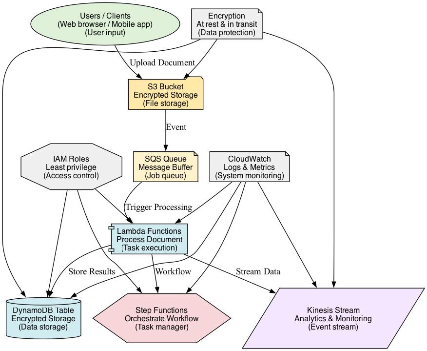

# Event-Driven Document Processing Pipeline (Terraform + LocalStack)

## Overview

This project builds a secure event-driven document processing architecture locally, simulating AWS using Terraform and LocalStack. The system demonstrates enterprise-grade security patterns for processing sensitive documents like insurance claims, medical records, and security incident reports.

## Architecture Layers
- **Storage Tier**: S3 buckets with encryption for document uploads
- **Processing Tier**: Lambda functions in secure execution environments
- **Orchestration Tier**: Step Functions for workflow management
- **Messaging Tier**: SQS queues for secure message handling
- **Data Tier**: DynamoDB with encryption for structured storage
- **Analytics Tier**: Kinesis streams for security event monitoring
- **Security Tier**: IAM roles, policies, and encryption throughout

## Key Features
- Complete document processing pipeline (Upload → Validate → OCR → Transform → Store)
- Encryption at rest and in transit for all data
- Least privilege IAM roles and security policies
- Secure event-driven architecture with S3 triggers and SQS messaging
- Audit trails and real-time security monitoring
- Modular Terraform structure with security best practices
- Fully local deployment (no AWS account required)

## Security Features
- Least privilege access - iam roles with only required permissions
- Secure processing - lambda functions run in isolated execution settings
- Audit trail - full processing logs through localstack
- Access controls - dynamodb with detailed access rules
- Secure messaging -  SQS with proper access policies

## Requirements
- Terraform 1.0+
- LocalStack
- AWS CLI
- Docker
- Python 3.9+

## Start LocalStack

<pre><code>docker run -d -p 4566:4566 \
  -e SERVICES=s3,lambda,sqs,stepfunctions,dynamodb,kinesis,iam \
  -e LAMBDA_EXECUTOR=docker \
  -v /var/run/docker.sock:/var/run/docker.sock \
  --name localstack \
  localstack/localstack</code></pre>

## Prepare Lambda Functions

<pre><code>cd lambda-functions
zip s3-trigger.zip s3-trigger.py
zip validate-document.zip validate-document.py
zip ocr-processor.zip ocr-processor.py
zip data-transformer.zip data-transformer.py
zip final-storer.zip final-storer.py
zip kinesis-analytics.zip kinesis-analytics.py
cp *.zip ../envs/dev/</code></pre>

## Test Pipeline

<pre><code># Upload test document
BUCKET_NAME=$(terraform output -raw s3_bucket_name)
echo "Security Incident Report" > test-doc.txt
aws --endpoint-url=http://localhost:4566 s3 cp test-doc.txt s3://$BUCKET_NAME/

# Open dashboard
open ../frontend/index.html</code></pre>

## Auto-Verification Script

<pre><code>#!/usr/bin/env bash
echo "Verifying secure pipeline deployment..."

echo "Terraform Outputs:"
(cd envs/dev && terraform output)

echo "S3 Buckets:"
aws --endpoint-url=http://localhost:4566 s3 ls

echo "Lambda Functions:"
aws --endpoint-url=http://localhost:4566 lambda list-functions \
 --query 'Functions[].[FunctionName,Runtime]' --output table

echo "SQS Queues:"
aws --endpoint-url=http://localhost:4566 sqs list-queues

echo "Step Functions:"
aws --endpoint-url=http://localhost:4566 stepfunctions list-state-machines \
 --query 'stateMachines[].[name,status]' --output table

echo "DynamoDB Tables:"
aws --endpoint-url=http://localhost:4566 dynamodb list-tables

echo "Kinesis Streams:"
aws --endpoint-url=http://localhost:4566 kinesis list-streams

echo "IAM Roles:"
aws --endpoint-url=http://localhost:4566 iam list-roles \
 --query 'Roles[?contains(RoleName, `dev-`)].RoleName' --output table

echo "Complete!"
</code></pre>

## Run Script

<pre><code>chmod +x verify-deployment.sh
./verify-deployment.sh</code></pre>

## Folder Structure

<pre><code>project3-event-driven-pipeline/
├── modules/
│   ├── s3-trigger/
│   │   ├── main.tf
│   │   ├── variables.tf
│   │   └── outputs.tf
│   ├── sqs-queue/
│   │   ├── main.tf
│   │   ├── variables.tf
│   │   └── outputs.tf
│   ├── step-functions/
│   │   ├── main.tf
│   │   ├── variables.tf
│   │   └── outputs.tf
│   ├── processing-lambdas/
│   │   ├── main.tf
│   │   ├── variables.tf
│   │   └── outputs.tf
│   ├── dynamodb-table/
│   │   ├── main.tf
│   │   ├── variables.tf
│   │   └── outputs.tf
│   └── kinesis-stream/
│       ├── main.tf
│       ├── variables.tf
│       └── outputs.tf
├── envs/
│   └── dev/
│       ├── main.tf
│       ├── variables.tf
│       ├── outputs.tf
│       └── terraform.tfvars
├── lambda-functions/
│   ├── s3-trigger.py
│   ├── validate-document.py
│   ├── ocr-processor.py
│   ├── data-transformer.py
│   ├── final-storer.py
│   └── kinesis-analytics.py
├── frontend/
│   ├── index.html
│   ├── app.js
│   └── styles.css
└── verify-deployment.sh</code></pre>

## Architecture Diagram

